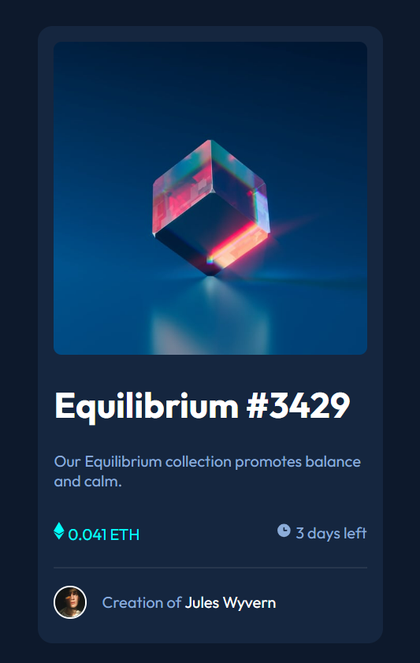

<!-- @format -->

# Frontend Mentor - NFT preview card component solution

This is a solution to the [NFT preview card component challenge on Frontend Mentor](https://www.frontendmentor.io/challenges/nft-preview-card-component-SbdUL_w0U). Frontend Mentor challenges help you improve your coding skills by building realistic projects.

## Table of contents

- [Overview](#overview)
  - [The challenge](#the-challenge)
  - [Screenshot](#screenshot)
  - [Links](#links)
- [My process](#my-process)
  - [Built with](#built-with)
  - [What I learned](#what-i-learned)
  - [Continued development](#continued-development)
  - [Useful resources](#useful-resources)
- [Author](#author)

## Overview

### The challenge

Users should be able to:

- View the optimal layout depending on their device's screen size
- See hover states for interactive elements

### Screenshot

### Links

- Solution URL: [Frontend Mentor Solution Site]()
- Live Site URL: [Live Site via GitHub Pages](https://salentipy.github.io/nft-preview-card-component-main/)

## My process

### Built with

- Semantic HTML5 markup
- CSS custom properties
- Flexbox

### What I learned

### Continued development

### Useful resources

- [Kevin Powell](https://www.youtube.com/@KevinPowell) - As I said above, Kevin's videos have been extremely helpful. They're informative, interesting, and well-produced. I inted to keep devouring them and recommend them to anyone in this same web dev journey.
- [The Markdown Guide](https://www.markdownguide.org/) - This is where I get all of my markdown information from. There is good info there and a nice cheat sheet, as well.
- [PX converter](https://nekocalc.com/px-to-rem-converter) - I use this resource a LOT trying not to use px anymore than I have to. I've learned/been told that rem is the best unit, overall, so I try to stick to that as much as possible.
- [Dillinger](https://dillinger.io/) - free resource to view markdown files
- [Lorem Picsum](https://picsum.photos/) - wonderful free image placeholder service

## Author

- You can find me as "salentipy" on all social media sites.
